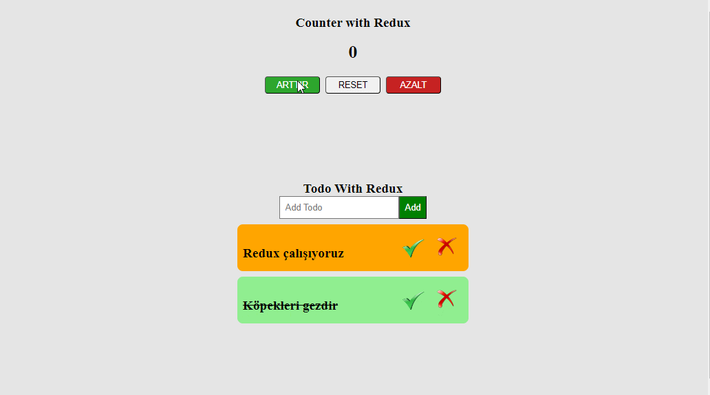

# Hi I'm Nurdoğan Bahadır 👋. Welcome to my Redux Intro Project with React.

This application was developed with React and Redux. It is a suitable application for getting started with Redux. There are two applications developed with redux in the project. One of these applications is counter and the other is a simple todo application.

# Live Link of the Project

[Click Me](https://redux-intro-nurdoganbahadir.netlify.app/)

# Libraries and Technologies I use

- Style components
- Redux 
- todo
- counter
  

# How to install

In the project directory, open the terminal and run:

### `npm install`

This will install the necessary dependencies. After that, you can run:

### `npm start`

# How does my project look

